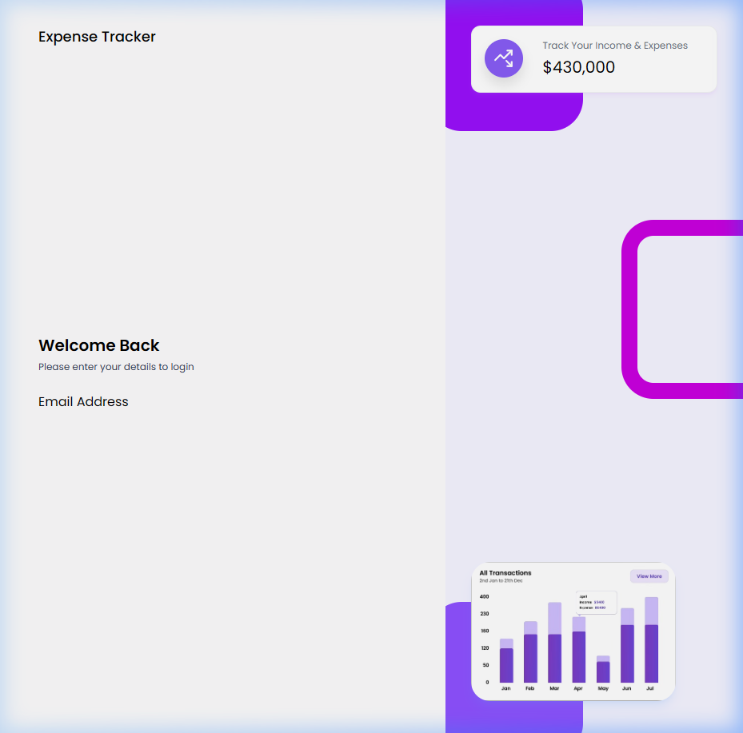
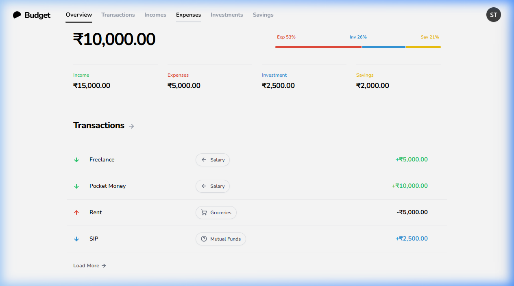
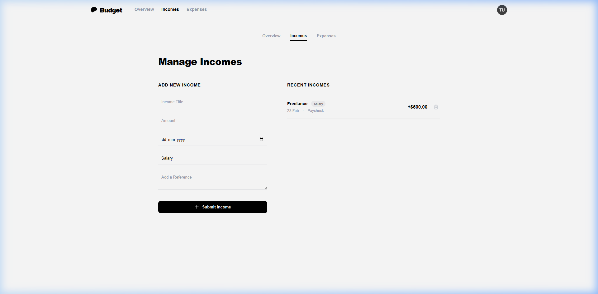
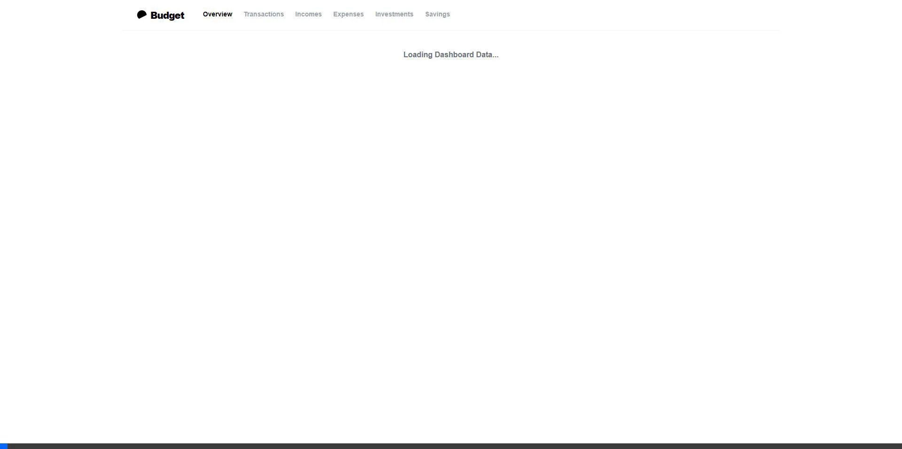

<div align="center">

# BUDGET 
## Personal Expense Management System

<br><br>

*Project report submitted in partial fulfillment of the requirement for the degree of*

**BACHELOR OF TECHNOLOGY**
<br>IN<br>
**INFORMATION TECHNOLOGY**

<br><br>

**Submitted By:**
Rishav Dhiman (Roll No. [Enter Roll No. Here])
[Add other group members if any]

<br><br>

**Under the Guidance of:**
[Enter Guide Name]
[Enter Guide Designation]

<br><br>

[Enter College Logo Here]
**[Enter College Name here]**
**[Enter Year here]**

---

</div>

<div style="page-break-after: always;"></div>

## CERTIFICATE
This is to certify that the project report entitled **"Budget: Personal Expense Management System"** submitted by **Rishav Dhiman** in partial fulfillment of the requirements for the award of the degree of Bachelor of Technology in Information Technology, is a record of bona fide work carried out under my guidance and supervision.

<br><br><br>

**Signature of Guide:** _______________
**Name of Guide:** [Enter Guide Name]
**Date:** _______________

<div style="page-break-after: always;"></div>

## ACKNOWLEDGEMENT
I would like to express my sincere gratitude to my guide, [Guide Name], for their invaluable support, patience, and direction during this project. I also extend my thanks to the Information Technology department for providing the resources and computational environment necessary to complete this software architecture.

<div style="page-break-after: always;"></div>

## ABSTRACT
In the modern digital era, effective personal financial management requires robust, omnipresent, and highly responsive software solutions. "Budget" is a full-stack web application engineered to provide real-time tracking of incomes, expenses, investments, and savings. Built upon the MERN (MongoDB, Express.js, React, Node.js) stack, the system leverages a microservices-inspired API architecture and a responsive Single Page Application (SPA) frontend.

The project addresses the inefficiencies of traditional manual logging and bloated enterprise software by offering a streamlined, RESTful API-driven platform. Key technical implementations include secure stateless authentication using JSON Web Tokens (JWT), password cryptography via bcryptjs, global state management using React's Context API, and a highly optimized client-side routing system mapping to dynamic UI components styled with Tailwind CSS. The resulting application is a performant, platform-agnostic financial ledger that emphasizes data security and optimal user experience (UX) without sacrificing algorithmic efficiency.

<div style="page-break-after: always;"></div>

## TABLE OF CONTENTS
1. **Introduction** 
2. **Problem Statement & Objectives**
3. **System Architecture** 
4. **Technology Stack & Frameworks** 
5. **Security & Authentication Subsystem** 
6. **API Design & Client State Management** 
7. **Implementation & Interface Visuals** 
8. **Conclusion & Future Scope** 

<div style="page-break-after: always;"></div>

## 1. INTRODUCTION
Personal financial management is a continuous computational and logistical challenge. The "Budget" application was developed to serve as an automated, highly available digital ledger. The system is designed to seamlessly compute cash flows, categorize transactions, and present aggregated financial metrics with minimal latency. We moved away from traditional monolithic Server-Side Rendered (SSR) MVC architectures in favor of a decoupled client-server model, utilizing a robust Node.js backend to serve a React-based SPA. This allows independent scaling of frontend presentation logic and backend data processing.

## 2. PROBLEM STATEMENT & OBJECTIVES
**The Problem:** Existing solutions for daily financial tracking are either excessively complex accounting systems or native device applications lacking reliable cross-platform cloud synchronization. Furthermore, many lightweight applications compromise on data security by relying on local storage or transmitting sensitive payloads without proper symmetric encryption or token-based authorization.

**Objectives:**
- Develop a decoupled, scalable RESTful API backend to handle asynchronous CRUD (Create, Read, Update, Delete) operations on structured financial records.
- Implement a secure, stateless authentication mechanism mitigating session hijacking and CSRF vulnerabilities.
- Engineer a responsive Single Page Application (SPA) utilizing virtual DOM reconciliation to minimize reflows and provide a seamless User Experience (UX).
- Utilize automated JSON parsing and scalable NoSQL schemas to calculate and present real-time financial health metrics.

## 3. SYSTEM ARCHITECTURE
The system operates on a decoupled Client-Server architecture following the MVC (Model-View-Controller) design pattern on the backend and a component-based UI paradigm on the frontend.

1.  **Client-Tier:** A Vite-compiled React Application handling the View layer, client-side routing (`react-router-dom`), and global state management.
2.  **Application-Tier:** An Express.js server hosted on Node.js acting as the Controller layer, handling HTTP request parsing, middleware execution, payload validation, and core business logic.
3.  **Data-Tier:** A managed MongoDB cluster providing a scalable JSON-based NoSQL persistence layer.

Connections between the client and application tiers are facilitated via asynchronous `axios` HTTP requests communicating with RESTful server endpoints.

## 4. TECHNOLOGY STACK & FRAMEWORKS

*   **MongoDB & Mongoose (Database Layer):** MongoDB was selected for its flexible schema design, utilizing BSON documents. Mongoose acts as the Object Data Modeling (ODM) library, enforcing strict schema validation and query abstraction at the application level before database persistence.
*   **Express.js & Node.js (Application Layer):** A lightweight runtime environment enabling non-blocking, event-driven I/O. Express provides the routing infrastructure necessary to mount middleware and handle stateless REST API endpoints efficiently.
*   **React & Vite (Presentation Layer):** React facilitates declarative UI development via the virtual DOM, heavily optimizing rendering performance. Vite is utilized as the build tool and development server, offering Hot Module Replacement (HMR) and optimized `esbuild` bundling.
*   **Tailwind CSS:** A utility-first CSS framework enabling rapid UI prototyping without CSS context switching, ensuring strict adherence to a predefined design system and mathematical responsive breakpoints.

<div style="page-break-after: always;"></div>

## 5. SECURITY & AUTHENTICATION SUBSYSTEM
Data security is a critical non-functional requirement given the highly sensitive nature of financial records. The application employs robust cryptographic paradigms to secure the application layer.

**Cryptographic Hashing (`bcryptjs`):** 
Plain-text passwords are never stored in the database. During the registration HTTP POST lifecycle, the application executes a pre-save Mongoose hook utilizing the `bcryptjs` library to generate a cryptographic salt (10 computational rounds) and hash the password payload string before saving the internal User Document.

```javascript
// Pre-save hook using bcryptjs in backend/models/User.js
UserSchema.pre('save', async function(next) {
    if (!this.isModified('password')) {
        next();
    }
    const salt = await bcrypt.genSalt(10);
    this.password = await bcrypt.hash(this.password, salt);
});
```

**Stateless Authentication (JSON Web Tokens):** 
The system avoids vulnerable scalable server-side session allocation (e.g., `express-session`), instead issuing a JSON Web Token (JWT) upon successful authentication. This token encapsulates the user's identity payload (`User._id`), signed symmetrically using a secure HMAC SHA256 algorithm via `process.env.JWT_SECRET`. The token maintains a predefined expiration window (`JWT_EXPIRE`).

```javascript
// Express Middleware for Route Protection in backend/middleware/auth.js
exports.protect = async (req, res, next) => {
    let token;
    // Extract token from Bearer Authorization header
    if (req.headers.authorization && req.headers.authorization.startsWith('Bearer')) {
        token = req.headers.authorization.split(' ')[1];
    }
    if (!token) return res.status(401).json({ error: 'Not authorized to access this route' });

    try {
        // Verify token signature and cryptographically decode payload
        const decoded = jwt.verify(token, process.env.JWT_SECRET);
        req.user = await User.findById(decoded.id);
        next(); // Pass control to the next middleware/controller
    } catch (err) {
        res.status(401).json({ error: 'Invalid token signature' });
    }
};
```

## 6. API DESIGN & CLIENT STATE MANAGEMENT
The React frontend relies heavily on optimized asynchronous communication and globally synchronized state to reduce extraneous network calls.

**Axios Interceptors:** 
To handle HTTP authorization seamlessly, a global Axios request interceptor injects the stored JWT from the browser's `localStorage` into the standard `Authorization: Bearer <token>` HTTP header for all outgoing API calls. This paradigm abstracts authentication configuration from individual component fetch logic.

```javascript
// Axios configuration in frontend/src/utils/api.js
api.interceptors.request.use((config) => {
  const token = localStorage.getItem('token');
  if (token) {
    config.headers.Authorization = `Bearer ${token}`;
  }
  return config; // Return mutated config object
});
```

**Global State (React Context API):** 
User authentication state (i.e., `user`, `token`, asynchronous `login` routines) is hoisted to a global React Context (`AuthContext`). This architectural pattern prevents inefficient "prop drilling" and ensures that state mutations trigger immediate cascading re-renders across all dependent child components (e.g., dynamically locking routes via the `PrivateRoute` and `PublicRoute` declarative wrappers).

<div style="page-break-after: always;"></div>

## 7. IMPLEMENTATION & INTERFACE VISUALS

### 7.1 Authentication & Route Guarding
The entry point of the React application enforces strict React Router DOM URL guarding. Unauthenticated clients attempting to access internal restricted routes are intercepted by the `PrivateRoute` higher-order component and redirected to the login view (`/login`). Context hooks provide immediate loading state verification.


*Figure 1: The Login Interface, implementing React controlled form components to bind internal immutable state directly to DOM input values via `onChange` event handlers.*

### 7.2 Dashboard & Data Aggregation
The Dashboard component utilizes the `useEffect` lifecycle hook to dispatch non-blocking `axios.get` requests, hydrating the frontend view with historical transaction array models. It utilizes array reduction methods (`reduce()`) to conditionally render aggregated mathematical totals derived dynamically from the fetched datasets, minimizing server-side computational overhead. Global navigation is facilitated through the top bar, where logo-bound `onClick` event listeners leverage `react-router-dom`'s `useNavigate` for zero-refresh client-side routing back to the root application state.


*Figure 2: The Dashboard SPA view, representing aggregated cash flows visually parsed from JSON payloads.*

### 7.3 Transaction Event Logging
The CRUD interfaces are designed for frictionless financial documentation. When a user submits an entry, the application executes a non-blocking `api.post` request. Upon receiving a 200 HTTP OK network acknowledgment, it injects the newly formed relational document into the local React state array (`setIncomes`), prompting an optimized partial DOM repaint via the Virtual DOM instead of a full page reload.


*Figure 3: The Incomes module using `Array.prototype.map()` to dynamically build functional JSX DOM nodes bounded by unique `_id` keys.*

### 7.4 Global Ledger & Time-Series Mapping
A comprehensive analytical history is compiled by fetching discrete document collections (e.g., Incomes, Expenses). The dataset arrays are concatenated and dynamically sorted client-side utilizing JavaScript's native sort algorithms against BSON `createdAt` Matrix timestamps, yielding an accurate chronological feed before DOM injection. Furthermore, the ledger implements interactive micro-components, such as a state-driven dropdown menu for instantaneous API deletion, leveraging react state callbacks for zero-refresh state reconciliation across all sibling DOM graphs.


*Figure 4: Global Transaction Ledger Interface performing asynchronous chronological integration.*

<div style="page-break-after: always;"></div>

## 8. CONCLUSION & FUTURE SCOPE
**Conclusion:**
"Budget" successfully implements a full-stack, distributed computational architecture to deliver a highly performant financial management platform. By eschewing older monolithic templates in favor of a decoupled Node/Express REST API and a lightweight React SPA frontend, the application exhibits ultra-low temporal latency and robust modular maintainability. The native implementation of JSON Web Token (JWT) stateless authorization alongside `bcryptjs` cryptographic hashing ensures industry-standard defense against data exfiltration and unauthorized endpoint access, successfully fulfilling the core academic and technical functional specifications defined for this B.Tech engineering project.

**Future Scope:**
- **MongoDB Aggregation Pipelines:** Shifting heavy numerical aggregations from client-side array reductions to MongoDB hardware-accelerated Aggregation Pipelines (e.g., `$match`, `$group`) to maintain logarithmic performance querying as data volume infinitely scales.
- **Data Visualization & Graph Algorithms:** Integration of charting libraries like Recharts or D3.js for multi-dimensional graphical analysis of the mapped data structures over time coordinates.
- **Docker Containerization:** Refactoring the deployment and CI/CD pipeline to leverage isolated Docker execution environments, ensuring immutable, consistent cross-platform scaling potential.
- **OAuth 2.0 Integration:** Implementing secure decentralized Single Sign-On (SSO) delegation strategies via providers such as Google or GitHub for enhanced user onboarding.
